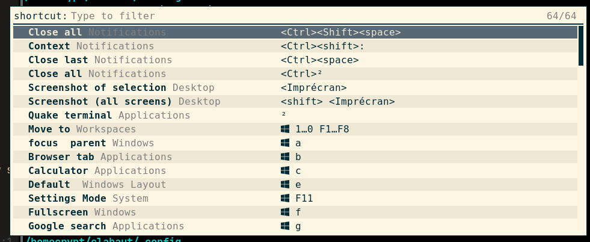

# Rofi i3 Shortcut Help

## Summary

This is a small shell *modi* script for rofi for presenting keybinding hints.  It is intended for use with the i3 window manager but it's also able to display keybindings from any suitably formatted config file.

The program functions by scanning and parsing comments in a specific format (use by regolith *remontoire* tool and described directly below), then displaying them in rofi. 



## Model

This script utilizes the concept of a `category` to group items, `action` to denote the human description, and `keybinding` to define the specific keys corresponding to the action.  The format is designed to be both easily parsable by program but also readable in it's native form by people:

```
## <category> // <action> // <keybinding> ## <reserved for user notes>
```

Text within `<category>`, `<action>`, and `<keybinding>` must not contain the sequences `##`, `//`, or line feeds.

Examples:

```
...
## Navigate // Relative Window // <Super> ↑ ↓ ← → ##
bindsym $mod+Left focus left
...
## Launch // Application // <Super> Space ## some extra notes that are ignored by Remontoire but maybe of interest to those reading the config file.
bindsym $mod+space exec $i3-wm.program.launcher.app
```

Any line that doesn't contain the structure listed here will be ignored.

## Requirements
You need:

- `rofi >= 1.6.0`
- `xmlstarlet`  package (use to escape input for pango markup).
- `i3-msg` binary from `i3` in order to launch the command associated to the shortcut.

## Usage

Update the `CACHE_FILE` and `CONFIG` variable to your need or set and export them before
calling the rofi command.

Launch the script with:
```
rofi -modi shortcut:~/full/path/to/shortcut.sh -show shortcut

```
You may add the following `bindsym` in you `i3` config file:
```
# For french keyboard
## System // Shortcut help //  ? ##
bindsym $mod+shift+comma exec rofi -modi shortcut:~/.config/rofi/scripts/shortcut.sh -show shortcut
```

Selecting a shortcut launch the associated command via `i3-msg`.
 

